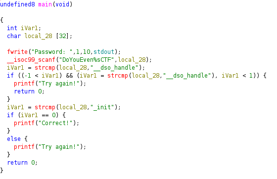
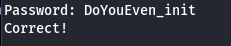

# Compiled
## IP
- 
## Task

Download the task file and get started. The binary can also be found in the AttackBox inside the /root/Rooms/Compiled/ directory.

Note: The binary will not execute if using the AttackBox. However, you can still solve the challenge.

## Steps

Ok, it will be classic Reverse Engineering task, let's open it with ghidra.

Our decompiled source code looks like this:

It means that in order to win local_28 should equal "_init", our local_28 is nested inside DoYouEven%sCTF string. It is important as scanf captures all after DoYouEven to CTF inclusively. For example:
When we type in DoYouEven_initCTF it will capture _initCTF, but if we type DoYouEven_init it will capture _init.
Here's the trick let's type it into our compiled program.

Works perfectly, password is our flag!

## Flag

Our flag is: **{DoYouEven_init}**