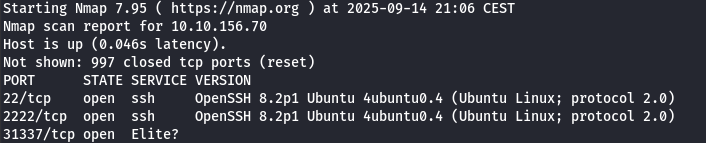
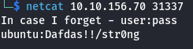
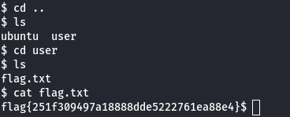

# Intermediate Nmap
## IP
- 10.10.156.70
## Task

You've learned some great nmap skills! Now can you combine that with other skills with netcat and protocols, to log in to this machine and find the flag? This VM 10.10.156.70 is listening on a high port, and if you connect to it it may give you some information you can use to connect to a lower port commonly used for remote access!

## Steps

First we do nmap scan:

`nmap -sV 10.10.156.70`

Port 31337 is opened. Let's connect with netcat.
Looks like it gifted us SSH passwords let's use them

Great now we are connected to SSH

Now quick traverse through directories and our flag is in flag.txt

## Flag

Our flag is: **flag{251f309497a18888dde5222761ea88e4}**
