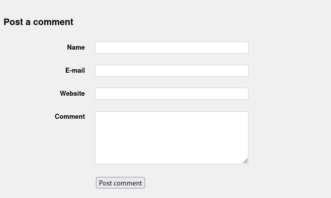
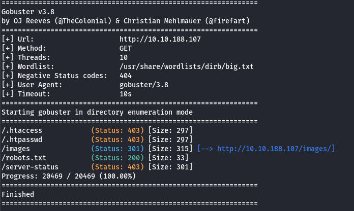
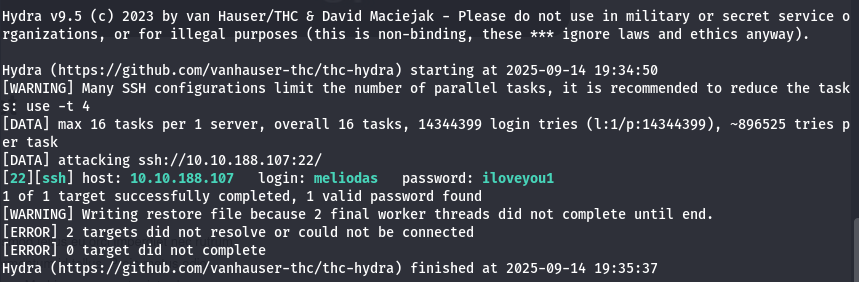
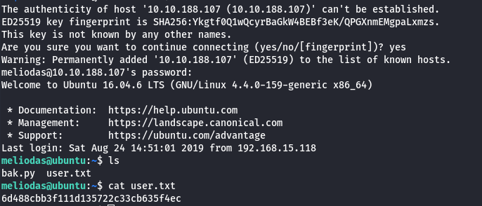
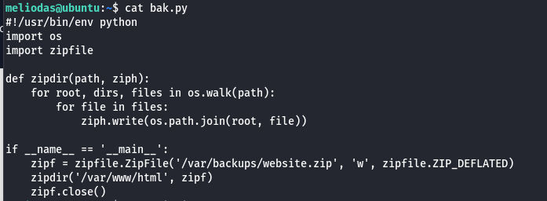
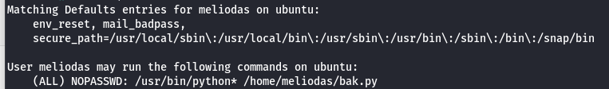
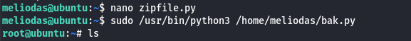
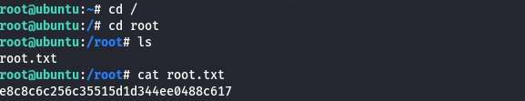

# Library
## IP
- 10.10.188.107
## Task

We need to find user and root flag.

## Steps

As always let's do nmap scan
`nmap -sV 10.10.188.107`
HTTP port is opened so let's navigate to website.

We see form on the bottom, let's look into it with Burp

Nothing special

Maybe GoBuster?

robots.txt seems interesting because of mystery `rockyou` word inside, for now it doesn't tell me anything, i will try to enum subdomains.

Well all enumerations went unsuccessful, only false-positives.

Now let's connect dots, robots.txt tell us rockyou, and SSH port is opened so maybe let's dict attack SSH with hydra and username from main post.

There we go our password is known c:

Okay so let's login to SSH and do some research for flags

`ssh meliodas@10.10.188.107`

First flag found!

So way to obtain root flag was tricky

First we need to examine *bak.py* file:

It imports zipfile library and running it is the only approved command to us with sudo without password:e 

Python first of all looks package in the same directory as script is so we need to do evil zipfile.py

`import os`

`os.system("/bin/bash")`

Then execute our *bak.py* script and there you go you are root!

Then navigate to root directory and flag will be there!

## Flag

Our user flag is: **6d488cbb3f111d135722c33cb635f4ec**

Our root flag is: **e8c8c6c256c35515d1d344ee0488c617**