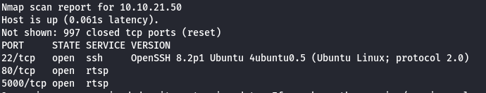
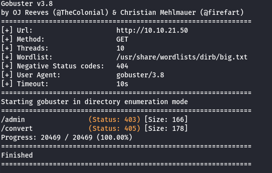
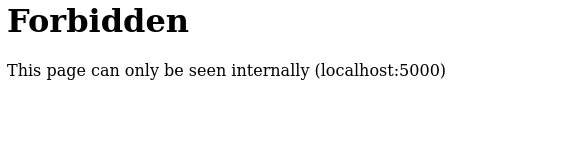
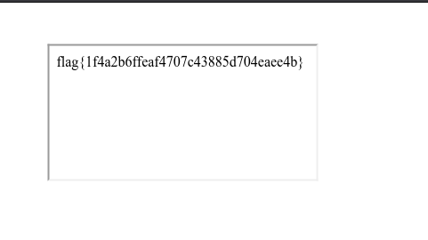

# MD2PDF
## IP
- 10.10.21.50
## Task

We need to exploit MD to PDF conversion website

## Steps

Target is very simple website.

First Step will be to scan it with nmap
It shows opened port 5000

Second step will be gobuster, and it finds admin path to our target.

So let's try to access *10.10.21.50/admin*

It indicates that we are permitted to access only internally.

We can trick our PDF converter with HTML `<iframe>`

Let's inject following code

`<iframe src="http://localhost:5000/admin" title="iframe"></iframe>`

Our flag is on generated PDF

## Flag

Our flag is: **flag{1f4a2b6ffeaf4707c43885d704eaee4b}**