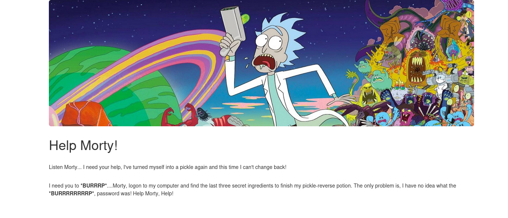
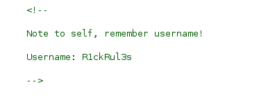
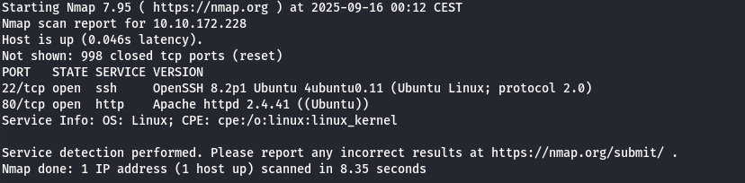
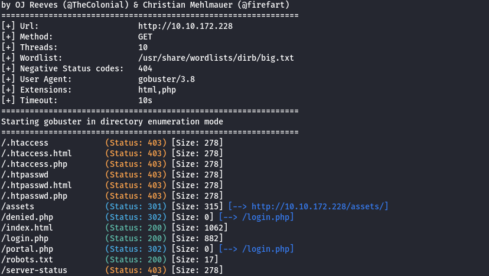
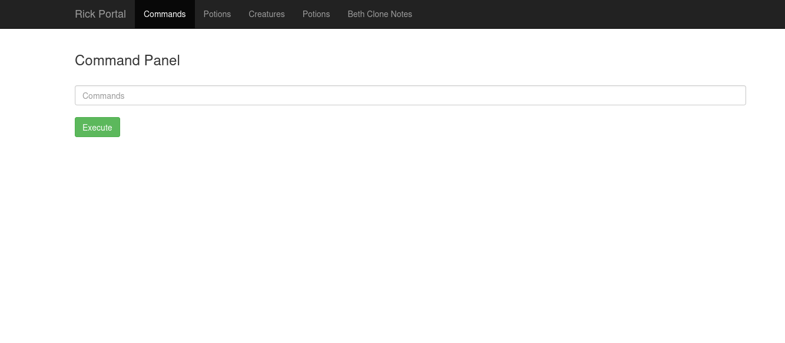
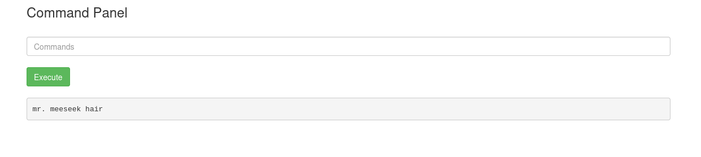
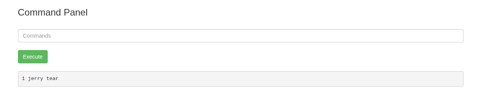
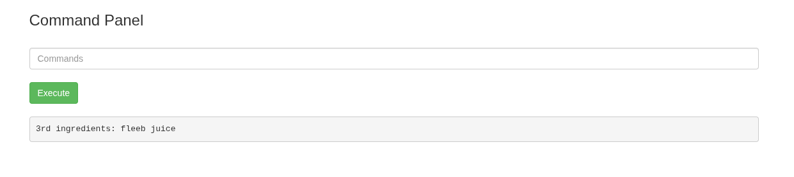

# Pickle Rick
## IP
- 10.10.172.228
## Task

This Rick and Morty-themed challenge requires you to exploit a web server and find three ingredients to help Rick make his potion and transform himself back into a human from a pickle.

Deploy the virtual machine on this task and explore the web application

## Steps

Ok so first hint on site were weird BURRRRRP words so let's use Burp Suite and check.

It seems that our first hint is in html as on photo, so let's save that username:

Let's do nmap scan!

SSH opened maybe we will try dict attack, but let's use GoBuster before.

`gobuster dir -w /usr/share/wordlists/dirb/big.txt -k -u http://10.10.172.228 -x html,php`

Gobuster found a login page, we will try to login using saved username and weird word from robots.txt

BINGO! Now we have access to command panel

After ls there was Sup3rS3cretPickl3Ingred.txt file in directory, cat command was blocked so after using less, first flag is ours.

After short path traversal we found second flag using following command `less "/home/rick/second ingredients"`

Interesting that after sudo -l we have access to all commands without password so we can easily access root folder
Inside root folder there was our third and last flag we did it !

`sudo less /root/3rd.txt`

## Flag

Our first flag is: **mr. meeseek hair**
Our second flag is: **1 jerry tear**
Our second flag is: **fleeb juice**