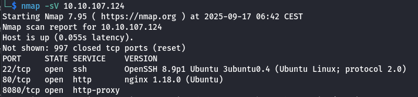
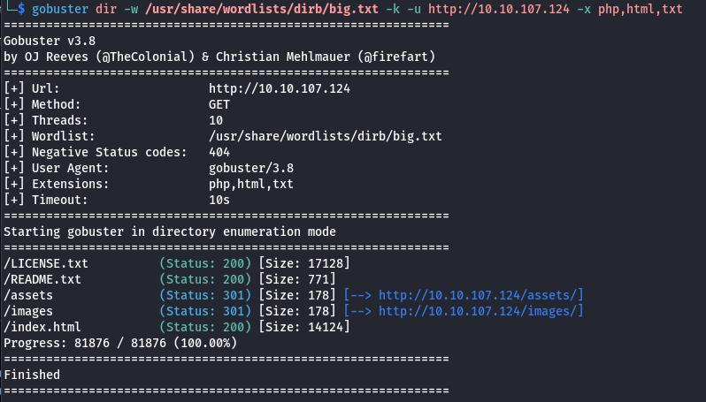
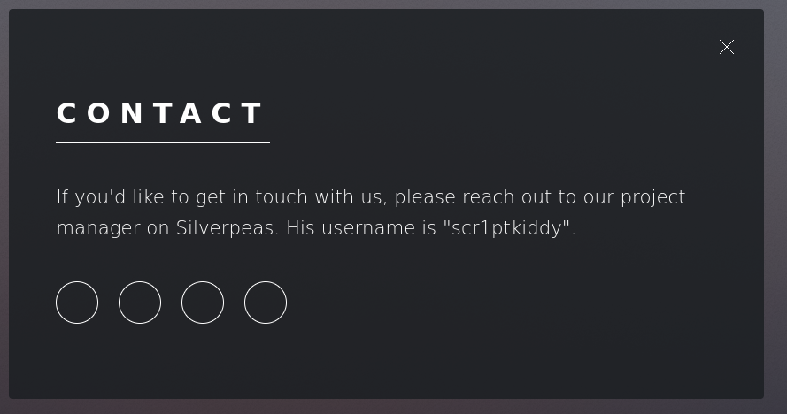
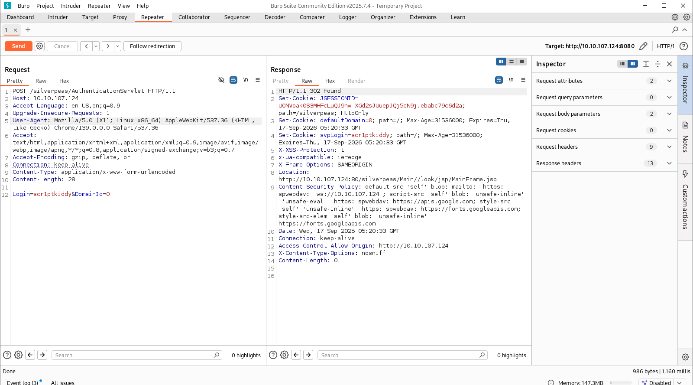
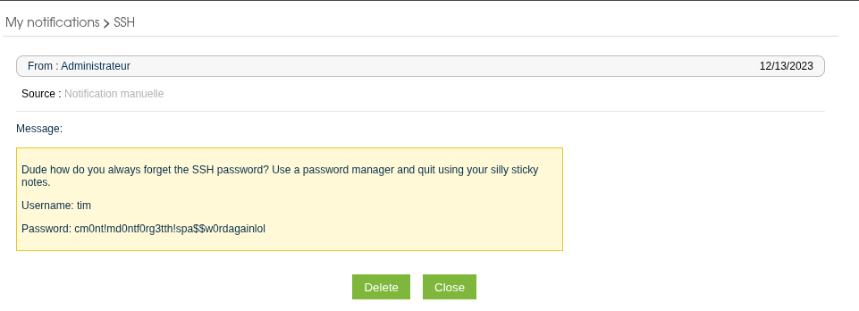
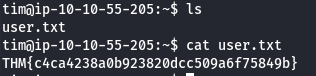
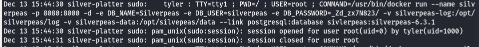
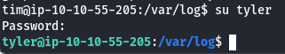
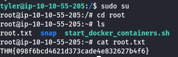

# Silver Platter
## IP
- 10.10.107.124
## Task

Think you've got what it takes to outsmart the Hack Smarter Security team? They claim to be unbeatable, and now it's your chance to prove them wrong. Dive into their web server, find the hidden flags, and show the world your elite hacking skills. Good luck, and may the best hacker win!

But beware, this won't be a walk in the digital park. Hack Smarter Security has fortified the server against common attacks and their password policy requires passwords that have not been breached (they check it against the rockyou.txt wordlist - that's how 'cool' they are). The hacking gauntlet has been thrown, and it's time to elevate your game. Remember, only the most ingenious will rise to the top. 

May your code be swift, your exploits flawless, and victory yours!

## Steps

Ok, so we have website of Hack Smarter Security, as usual let's start with nmap, gobuster, and burp to look for some interesting findings.

Nmap shows opened SSH port and interesting 8080 port.

GoBuster also doesn't found any interesting directories

Burp Suite yielded no results.

But if we head to contact page we will encounter information about silverpeas application and that software often runs at port 8080, additionally we have username and known CVE for silverpeas so let's break it.

We can access Silverpeas by accessing 10.10.107.124:8080/silverpeas. We will use CVE-2024-36042. From source code we know that it operates on 6.3.1 version so as the all versions before 6.3.5 are vulnerable we can use that exploit.

https://github.com/zaaraZiof0/CVE-2024-36042

So let's get our silverpeas app into Burp.

We are performing vulnerable request where we are omitting password authentication.

Next we are opening request in browser (don't forget to add 8080 port to IP address), and now we are logged in as scr1ptkiddy.

Okey only interesting things on that profile were Manager and Adminstrator accounts, let's try to access them.

Well, on manager account there is SSH password leaked, let's write this down

I can't access administrator account so let's proceed to SSH.

While doing this my machine has unexpectedly stopped. I started new on IP 10.10.55.205.

First flag appeared after just using ls.

Now its time for privilege escalation!

Okey so after scanning with LinPEAS.sh, I noticed that we have full access to /var/log/, so i searched through auth.log files and found plaintext password for tyler.

after sudo -l, it shows that tyler can run all commands as root so lets root yourself.

Finally we obtained both user and root flags!

## Flag

Our user flag is: **THM{c4ca4238a0b923820dcc509a6f75849b}**
Our root flag is: **THM{098f6bcd4621d373cade4e832627b4f6}**