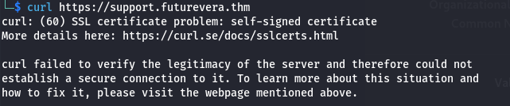
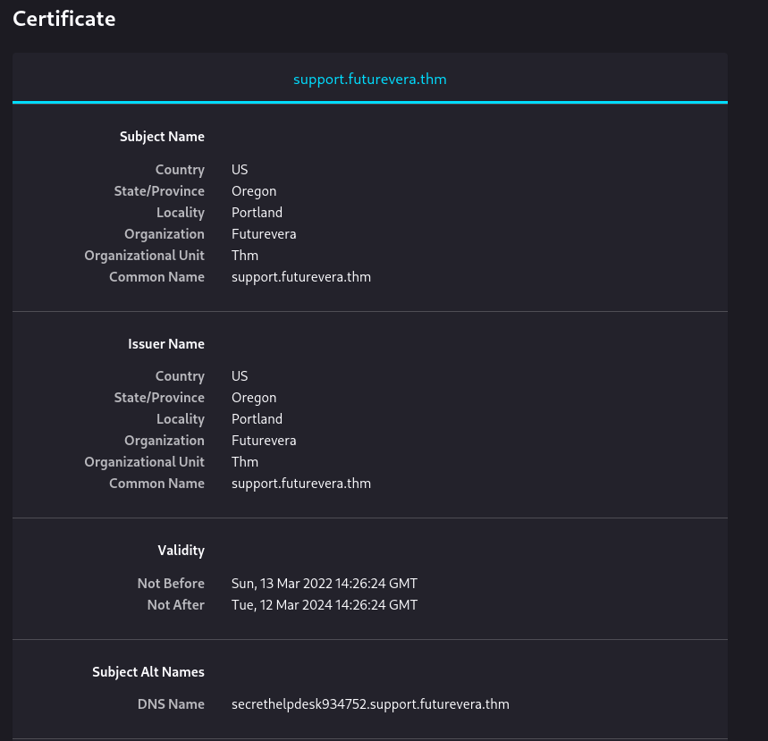
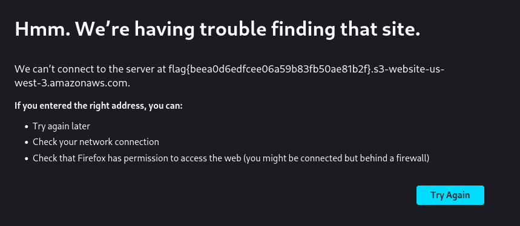

## TakeOver
# IP
- 10.10.153.84
# Description

>"Hello there,
>I am the CEO and one of the co-founders of futurevera.thm. In Futurevera, we believe that the future is in space. We do a lot of space research and write blogs about it. We used to help students with space questions, but we are rebuilding our support.

>Recently blackhat hackers approached us saying they could takeover and are asking us for a big ransom. Please help us to find what they can takeover.

>Our website is located at https://futurevera.thm

>Hint: Don't forget to add the MACHINE_IP in /etc/hosts for futurevera.thm ; )"

# Steps

1. First we need to add Target IP to /etc/hosts in order to access site
`sudo echo "10.10.153.84 futurevera.thm" >> /etc/hosts`

2. As in description challenge is about subdomain enumeration so let's do it with FFuF, let's examine what response size to filter from results.

Ok, we need to exclude size 4605

3. Let's FUZZ
`ffuf -w /usr/share/wordlists/subdomains_tiny.txt -u http://futurevera.thm/ -H "Host: FUZZ.futurevera.thm" -fs 0,4605`

now we need to add 2 new hosts to */etc/hosts* to access them in browser
`sudo echo "10.10.153.84 blog.futurevera.thm" >> /etc/hosts`
`sudo echo "10.10.153.84 support.futurevera.thm" >> /etc/hosts`

4. I tried to enumerate directories but only assets folder was available and it was empty

Sooo maybe curl discovered subdomains
`curl support.futurevera.thm`

Some problems with certificate hmm...

Let's check certificate

Interesting DNS Name don't you think?
let's add it to */etc/hosts*

`sudo echo "10.10.153.84 secrethelpdesk934752.support.futurevera.thm" >> /etc/hosts`

Accessed the site and our flag is here 

# Flag

Our flag is: **flag{beea0d6edfcee06a59b83fb50ae81b2f}**
